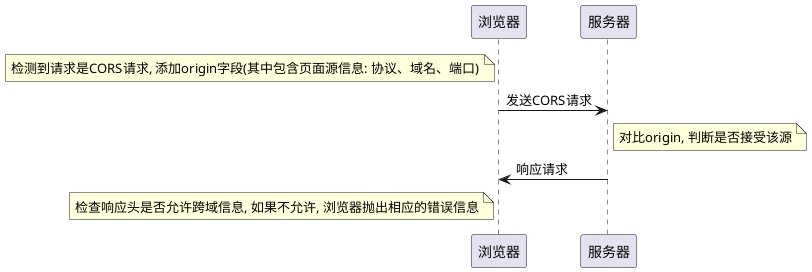

# HTTP

## HTTP 简介

定义: `Web`使用一种名为`HTTP`（`HyperText Transfer Protocol`，超文本传输协议）的协议作为规范，完成从客户端到服务器等一系列运作流程。而协议是指规则的约定。可以说，`Web`是建立在`HTTP`协议上通信的。

采用请求/响应模型

- 请求报文

  - 请求方法
  - `URL`
  - 协议版本
  - 请求头部
  - 请求数据

- 状态行(响应)
  - 协议版本
  - 成功或者错误的代码
  - 服务器信息
  - 响应头部
  - 响应数据

特点: 不保存状态的协议 -> 无状态协议

## `TCP/IP` 协议族

- 应用层
  应用层规定了向用户提供应用服务时通信的协议
  例如:
  - `FTP`(`File Transfer Protocol`, 文件传输协议)
  - `DNS`(`Domain Name System`, 域名系统)
  - `HTTP`
- 传输层
  传输层对接上层应用层, 提供处于网络连接中两台计算机之间的数据传输所使用的协议
  传输层有两个性质不同的协议:
  - `TCP`(`Transmission Control Protocol`) - 传输控制协议
    - 全双工
    - 三次握手建立连接, 四次挥手断开连接 -> 传输稳定可靠
    - 没有`UDP`那么高效
  - `UDP`(`User Data Protocol`) - 用户数据报协议
    - 面向无连接
    - 不保证有序且不丢失的传递到对端(不稳定)
    - 高效轻便
- 网络层
  网络层规定了数据通过怎么样的传输路线到达对方计算机(`IP`协议)
  与对方计算机之间通过多台计算机或网络设备进行传输时，网络层所起的所用就是在众多的选项内选择一条传输路线。
- 链路层
  用来处理连接网络的硬件部分, 包括控制操作系统, 硬件的设备驱动, `NIC`(`Network Interface Card`, 网络适配器, 网卡), 及光纤等物理可见部分

**一般的 web 应用通信传输流是这样的**

# 名词辨析

- 串行连接: `HTTP`有无连接的特性，即每次连接只能处理一个请求，收到响应后立即断开连接。`HTTP/1.0`版本（称为串行连接或短连接、短轮询）中每次`HTTP`通信后都要断开`TCP`连接，所以每个新的`HTTP`请求都需要建立一个新的连接。
- 持久连接:　长连接，长轮询。
  - 一定时间内，同一域名下的`HTTP`请求，只要两端都没有提出断开连接，则持久保持`TCP`连接状态，其他请求可以复用这个连接通道。
  - `HTTP/1`实现并默认了所有连接都是持久连接，这样客户端发起多个`HTTP`请求时就减少了`TCP`握手造成的网络资源和通信时间的浪费。
  - 缺点:　持久连接采用阻塞模式，下次请求必须等到上次响应返回后才能发起，如果上次的请求还没返回响应内容，下次请求就只能等着（就是常说的线头阻塞）
- 管道化持久连接: 管道化可以不用等待响应返回而发送下个请求并按顺序返回响应, 现代浏览器并未默认开启管道化
  - 多个请求共用同一个`TCP`连接
  - 不用等待可以发出多个请求
  - 响应必须按顺序返回
- `HTTP/2.0`多路复用: 每个`HTTP`请求都有一个序列标识符, 这样浏览器就可以并发多个请求, 服务器收到数据根据标识符重新排列成不同的请求报文, 而不会导致数据错乱。同样服务器可以返回多个响应给浏览器
- `WebSocket`: `HTML5`提出的一种客户端和服务端通讯的全双工协议

## URI

`HTTP`协议使用`URI`定位互联网上的资源。概念：

- `URI`(`Universal Resource Identifier`：统一资源标识符)
- `URL`(`Universal Resource Locator`：统一资源定位符)
- `URN`(`Universal Resource Name`：统一资源名称)。

# `HTTP`版本

1. 现代浏览器在与服务器建立了一个 `TCP` 连接后是否会在一个 `HTTP` 请求完成后断开？什么情况下会断开？

   如果没有`keep-alive`的话，发送完请求就断开连接

   如果使用`keep-alive`的话，节省`TCP`建立连接的资源，同时`SSL`的开销也能避免

2. 一个 `TCP` 连接可以对应几个 `HTTP` 请求？

   一个`TCP`连接可以发送多个`HTTP`请求
   `HTTP`属于应用层, `TCP`属于传输层, 可以理解为`HTTP`通过`TCP`去传输

3. 一个 `TCP` 连接中 `HTTP` 请求发送可以一起发送么（比如一起发三个请求，再三个响应一起接收）？

   `HTTP/1.1`的单个`TCP`连接在同一时刻只能处理一个请求, 两个请求的生命周期不能重叠, 任意两个`HTTP`请求从开始到结束的时间在同一个`TCP`连接里不能重叠

   `HTTP/1.1`规范中规定了`Pipelining`来试图解决这个问题(这个功能在浏览器中是默认关闭的)

   > RFC 2616:
   > A client that supports persistent connections MAY "pipeline" its requests (i.e., send multiple requests without waiting for each response). A server MUST send its responses to those requests in the same order that the requests were received.
   >
   > 一个支持持久连接的客户端可以在一个连接中发送多个请求(不用等待任意连接的响应), 收到请求的服务端必须按照请求收到的顺序发送响应

4. 为什么有的时候刷新页面不需要重新建立 `SSL` 连接？

   `TCP`连接未断开
   如果使用`keep-alive`的话，节省`TCP`建立连接的资源，同时`SSL`的开销也能避免

5. 浏览器对同一 `Host` 建立 `TCP` 连接到数量有没有限制？

   不同的浏览器有不同的数量要求, `Chrome`最多是同一个`Host`下最多有 6 个`TCP`连接

## `HTTP/1.0`

简单的网页和网络请求, 比较简单
特点: 每次请求都打开一个新的`TCP`连接, 收到响应之后立即断开连接

## `HTTP/1.1`

- 引入更多缓存控制策略, 如`Entity tag`, `If-Unmodified-Since`, `If-Match`, `If-None-Match`等
- 允许范围请求, 即在请求头中加入`Range`头部
- 请求消息和响应消息都必须包含在`Host`头部, 以区分同一个物理主机中的不同虚拟主机的域名
- 默认开启持久连接

## keep-alive

- `TCP`里面的`KeepAlive`
  侧重点在于保持客户端和服务端的连接
  一方会不定期给另一方发送心跳包, 如果间隔发送几次, 对方返回的都是`RST`, 而不是`ACK`, 则会断开连接

  `TCP`的`KeepAlive`机制意图在于保活、心跳，检测连接错误。当一个`TCP`连接两端长时间没有数据传输时(通常默认配置是 2 小时)，发送`keepalive`探针，探测链接是否存活。

  缺点:

  - 只能检测连接是否存活, 不能检测连接是否可用
  - 依赖于操作系统的实现, 灵活性不够
  - 代理或者负载均衡器会让其失效

- `HTTP`的`keep-alive`
  一般在中间会带上横杠
  普通的`http`连接时客户端连接上服务端,然后结束请求后, 由客户端或者服务端进行`http`连接的关闭

  但是一旦客户端发送`connection:keep-alive`头给服务端，且服务端也接受这个`keep-alive`的话，两边对上暗号，这个连接就可以复用了，一个`http`处理完之后，另外一个`http`数据直接从这个连接走了。减少新建和断开`TCP`连接的消耗。

  `HTTP`协议的`Keep-Alive`意图在于短时间内连接复用，希望可以短时间内在同一个连接上进行多次请求/响应。

  为什么需要`keep-alive`?

  因为一个网页有很多资源文件, 如果按照之前请求一个资源就创建一个连接, 然后关闭, 代价比较大。因此希望能够短时间复用`http`协议, 在加载同一个网页中的内容时，尽量复用连接

  在`HTTP1.1`中默认开启，通过`headers`设置`Connection: close`关闭

  在`HTTP1.0`中默认关闭，通过`headers`设置`Connection: Keep-Alive`开启

  `Keep-Alive`属性保持连接的时间长度由服务器决定，通常配置都是几十秒

`TCP`层是没有请求的概念，`HTTP`协议是事务性协议才有请求的概念，`TCP`报文承载`HTTP`协议的请求(`Request`)和响应(`Response`)。

## `HTTP/2`

HTTP/2 没有小版本, 希望直接过渡到 HTTP/3.0 版本

两个重要概念:

- 帧(`frame`): 数据传输的最小单位, 每个帧都有序列标识表明该帧属于哪个流
- 流(`stream`): 多个帧组成的数据流, 每个流表示一个请求

新特性:

- 新的二进制格式, `HTTP/1.x`基于文本, 解析存在天然缺陷。
- 多路复用:
  - 一个`TCP`连接可以存在多个流, 服务端则可以通过帧中的标识知道该帧属于哪个流（即请求），通过重新排序还原请求。
  - 允许并发的发起多个请求，每个请求及该请求的响应不需要等待其他的请求或响应，避免了线头阻塞问题, 提高传输性能
- 头部压缩: 使用`encoder`减少需要传输的头部大小, 通讯双方各自`cache`一份头部`fields`表, 避免重复头部的传输, 减小了需要传输的大小
- 服务端推送: 这里的服务端推送指把客户端所需要的`css/js/img`资源伴随着`index.html`一起发送到客户端，省去了客户端重复请求的步骤（从缓存中取）

##　`HTTP/3.0`
`HTTP/2.0`的缺点: 因为多路复用, 同一域名下只需要使用一个`TCP`连接, 连接出现了丢包, 整个`TCP`都要等待重连, 导致后面的数据都被阻塞了。
`HTTP/1.x`因为使用多个`TCP`连接, 单个`TCP`出现丢包, 只会影响一个连接

# `HTTP`报文

用于`HTTP`协议交互的信息被称为`HTTP`报文:

- 客户端的`HTTP`报文叫请求报文
  - 请求行(请求方法, 协议版本)
  - 请求首部(请求`URI`, 客户端信息等)
  - 内容实体(用户信息和资源信息等)
    
- 服务端的`HTTP`报文叫响应报文
  - 状态行(协议版本, 状态码)
  - 响应首部(服务器名称, 资源标识等)
  - 内容实体(服务器返回的资源信息)
    

## 请求方法

- `GET`：一般用于获取服务器资源
- `POST`：一般用于传输实体主体
- `PUT`：一般用于传输文件
- `DELETE`：用于删除文件
- `HEAD`：用于获取报文首部，不返回报文主体
- `OPTIONS`：用于询问请求`URI`资源支持的方法

`GET`方法和`POST`方法的区别:

- 从缓存的角度来看, GET 请求会被浏览器主动缓存下来, 留下历史记录, 而 POST 默认不会
- 从编码的角度来看, GET 只能进行 URL 编码, 只能接收 ASCII 字符, 而 POST 没有限制
- 从参数的角度来看, GET 请求一般放在 URL 里面, 明文传输, POST 放在请求体里面, 更适合传输敏感信息
-

## 状态码

`2XX`: 成功
`3XX`: 重定向（表明浏览器要执行特殊处理）
`4XX`: 客户端错误
`5XX`: 服务器错误

## 首部字段

略

## 两种请求

浏览器发送`CORS`请求（跨域请求）时, 会将请求分为简单请求与复杂请求

简单请求:

1. 请求的方法只能为`HEAD`、`GET`、`POST`
2. 无自定义请求头
3. `Content-Type`只能是这几种：
   - `text/plain`
   - `multipart/form-data`
   - `application/x-www-form-urlencoded`

简单请求 - 先执行后判断

复杂请求:

1. `PUT`, `DELETE`方法的`ajax`请求
2. 发送`JSON`格式的`ajax`请求(比如`post`数据)
3. 带自定义头的`ajax`请求

复杂请求在发生请求时, 如果是 CORS 请求，浏览器预先发送一个 option 请求。浏览器这种行为被称之为预检请求（注意如果不是跨域请求就不会发生预检请求，比如反向代理）。
